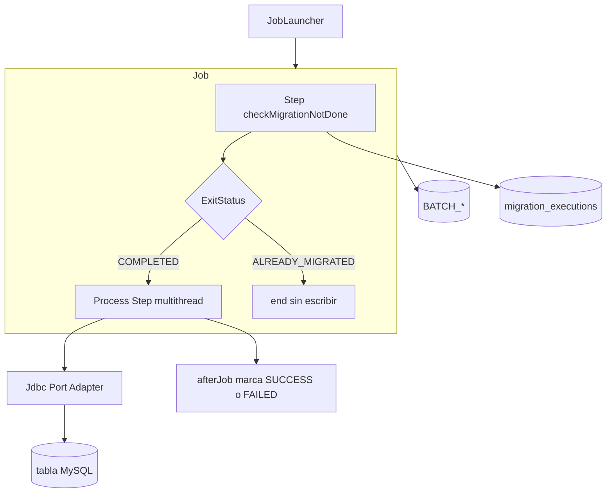
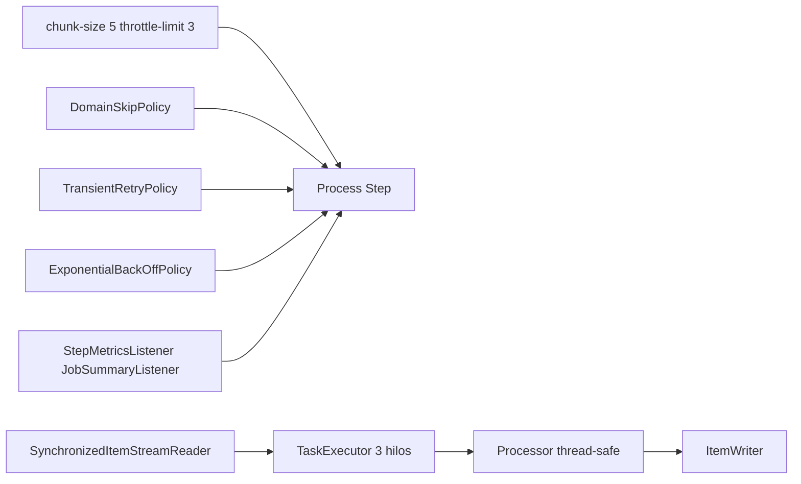

# Jobs de migración

Cada job sigue el patrón Spring Batch chunk-oriented, con un **guard** previo que consulta el ledger `migration_executions` para no reescribir datos ya migrados con éxito.

## Patrón común



## Escalado y resiliencia



Escalado por **multithreading** (`TaskExecutorRepeatTemplate` + pool acotado). No se usa particionado (`PartitionHandler`): un CSV por job y, en anual, agregación cross-chunk hacen que MT sea el fit correcto.

Parámetros en `application.yml`:

| Propiedad | Default | Uso |
|---|---|---|
| `migration.batch.chunk-size` | 5 | Tamaño de chunk |
| `migration.batch.throttle-limit` | 3 | `corePoolSize` / `maxPoolSize` / `queueCapacity` del `TaskExecutor` |
| `migration.batch.skip-limit` | 100 | Máximo de skips de dominio/parse |
| `migration.batch.retry-limit` | 3 | Reintentos de errores transitorios JDBC |

BackOff fijo en código: `ExponentialBackOffPolicy` (initial 1000 ms, multiplier 2.0, max 10000 ms) entre reintentos JDBC.

## dailyTransactionsJob

| Elemento | Valor |
|---|---|
| CSV | `data/semana_2/transacciones.csv` (default) |
| Guard | `checkDailyMigrationNotDone` |
| Process | `processDailyTransactions` |
| Puerto | `DailyReportWriter` → `JdbcDailyReportWriter` |
| Tabla | `daily_transaction_reports` |

Procesa transacciones, registra la anomalía `HIGH_AMOUNT` en el reporte y omite montos no positivos. Los duplicados por business key (`fecha|monto|tipo`) lanzan `DomainError` y se omiten (`skip`). `AnomalyDetector` usa set concurrente para multithreading.

## monthlyInterestsJob

| Elemento | Valor |
|---|---|
| CSV | `data/semana_2/intereses.csv` |
| Guard | `checkMonthlyMigrationNotDone` |
| Process | `calculateMonthlyInterests` |
| Puerto | `AccountBalanceWriter` → `JdbcAccountBalanceWriter` |
| Tabla | `account_balances` |

## annualGenerationJob

| Elemento | Valor |
|---|---|
| CSV | `data/semana_2/cuentas_anuales.csv` |
| Guard | `checkAnnualMigrationNotDone` |
| Process | `compileAnnualAudit` |
| Puerto | `AnnualAuditWriter` → `JdbcAnnualAuditWriter` |
| Tabla | `annual_audit_reports` |

El writer Batch acumula movimientos de **todos** los chunks (buffer sincronizado) y consolida por `cuenta_id` vía `AnnualAccountCompiler` al cerrar el step. El processor deduplica con `ConcurrentHashMap.newKeySet()` (thread-safe bajo MT).

## Skip / retry / listeners

- **SkipPolicy** `DomainSkipPolicy`: `DomainError` y `FlatFileParseException` hasta `skip-limit`
- **RetryPolicy** `TransientDataAccessRetryPolicy`: solo `TransientDataAccessException`
- **BackOffPolicy** `ExponentialBackOffPolicy`: 1s → ×2 → tope 10s entre retries
- **SkipListener**: log WARN con `thread=`, fase, tipo de excepción e item
- **RetryListener** `LoggingRetryListener`: log INFO con `attempt`, `thread`, tipo de excepción y motivo en cada reintento JDBC transitorio
- **StepMetricsListener**: duración y throughput por step
- **JobSummaryListener**: duración del job + `chunkSize` / `throttleLimit` al inicio
- **ChunkThroughputListener**: DEBUG por chunk (nombre de thread)

Processors stateful usan `processorNonTransactional()` y beans `@StepScope`.

## Comparación de parámetros (configuración óptima local)

Para cumplir el requisito de comparar configs de escalado:

```bash
# 1. Generar CSV grande
python3 scripts/generate-performance-data.py

# 2. Revertir ledger/tablas entre corridas
docker compose exec -T mysql mysql -umigration -pmigration xyz_bank_migration < scripts/revert-migration.sql

# 3a. Baseline single-thread
./mvnw spring-boot:run -Dspring-boot.run.profiles=performance \
  -Dspring-boot.run.arguments="--spring.batch.job.enabled=true --spring.batch.job.name=dailyTransactionsJob --migration.batch.throttle-limit=1"

# 3b. Multithread (default óptimo local)
docker compose exec -T mysql mysql -umigration -pmigration xyz_bank_migration < scripts/revert-migration.sql
./mvnw spring-boot:run -Dspring-boot.run.profiles=performance \
  -Dspring-boot.run.arguments="--spring.batch.job.enabled=true --spring.batch.job.name=dailyTransactionsJob --migration.batch.throttle-limit=3"
```

En los logs registrá:

| Corrida | `throttle-limit` | `chunk-size` | `throughputPerSec` | duración step | Notas |
|---|---|---|---|---|---|
| A | 1 | 5 | _(completar)_ | _(completar)_ | Baseline |
| B | 3 | 5 | _(completar)_ | _(completar)_ | Default |
| C (opcional) | 3 | 50 | _(completar)_ | _(completar)_ | Chunks más grandes |

**Configuración óptima local elegida:** `throttle-limit=3`, `chunk-size=5` — paralelismo observable sin saturar MySQL local ni el `JobRepository`; chunks chicos dan commits frecuentes y métricas claras en demos.

Buscá en logs: `Starting job=... chunkSize=... throttleLimit=...` y `Step metrics ... throughputPerSec`.

## Ledger anti-duplicados

Tabla `migration_executions` (`job_name`, `status`, `executed_at`, `write_count`, `skip_count`).

1. Si existe fila `SUCCESS` para el job → exit `ALREADY_MIGRATED` y el job termina sin procesar.
2. Tras un process `COMPLETED` → `markSuccess`.
3. Tras `FAILED` → `markFailed`.

Los jobs usan `RunIdIncrementer`: cada `spring-boot:run` crea una nueva instancia Batch y siempre pasa por el guard.

Para volver a migrar: ejecutar [`scripts/revert-migration.sql`](../scripts/revert-migration.sql). Ver [mysql.md](mysql.md).

## Cómo encaja la arquitectura

El sistema está organizado como un **monolito modular hexagonal**: cada job es un bounded context (`dailytransactions`, `monthlyinterests`, `annualreports`) con dominio propio, puertos de escritura y adapters JDBC. Lo transversal (pool, skip/retry/backoff, métricas, ledger) vive en `shared`.

Flujo de un job de punta a punta:

1. **Entrada** — CSV (`FlatFileItemReader` envuelto en `SynchronizedItemStreamReader` para MT).
2. **Validación y transformación** — `ItemProcessor` + invariantes de dominio (`DomainError` → skip).
3. **Salida** — `ItemWriter` Batch → puerto de aplicación → adapter JDBC → tabla MySQL.
4. **Orquestación** — guard consulta `migration_executions`; el process step corre en paralelo con el pool compartido; al terminar, el ledger marca `SUCCESS` o `FAILED`.

Capas de resiliencia en el process step:

| Capa | Responsabilidad |
|---|---|
| Dominio / processor | Rechaza datos inválidos o duplicados de negocio |
| `DomainSkipPolicy` | Omite corruptos/parse errors sin abortar el lote |
| `TransientDataAccessRetryPolicy` + backoff | Reintenta fallos JDBC transitorios con espera exponencial |
| Listeners | Observabilidad (skips por hilo, throughput, resumen de job) |

El escalado es **multithreading sobre un step chunk-oriented**, no particionado: un archivo por job y, en anual, agregación cross-chunk hacen que un pool acotado (`throttle-limit`) sea suficiente. Los parámetros se ajustan midiendo `throughputPerSec` (ver sección de comparación arriba).
