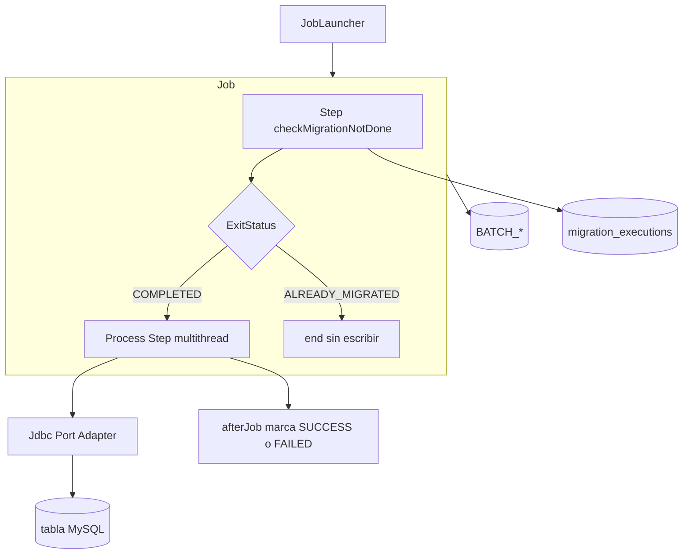
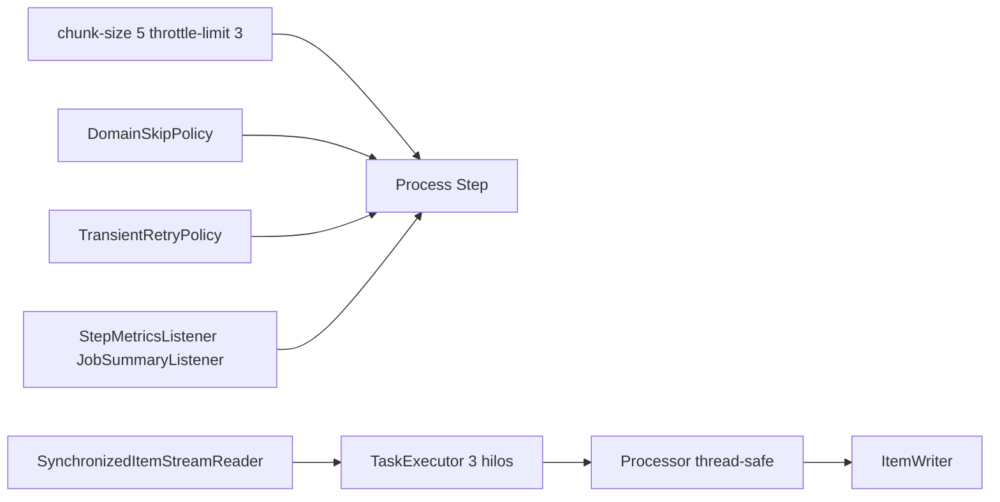

# Jobs de migración

Cada job sigue el patrón Spring Batch chunk-oriented, con un **guard** previo que consulta el ledger `migration_executions` para no reescribir datos ya migrados con éxito.

## Patrón común



## Escalado y resiliencia



Parámetros en `application.yml`:

| Propiedad | Default | Uso |
|---|---|---|
| `migration.batch.chunk-size` | 5 | Tamaño de chunk |
| `migration.batch.throttle-limit` | 3 | Hilos del `TaskExecutor` / `RepeatOperations` del process step |
| `migration.batch.skip-limit` | 100 | Máximo de skips de dominio/parse |
| `migration.batch.retry-limit` | 3 | Reintentos de errores transitorios JDBC |

## dailyTransactionsJob

| Elemento | Valor |
|---|---|
| CSV | `data/semana_2/transacciones.csv` (default) |
| Guard | `checkDailyMigrationNotDone` |
| Process | `processDailyTransactions` |
| Puerto | `DailyReportWriter` → `JdbcDailyReportWriter` |
| Tabla | `daily_transaction_reports` |

Procesa transacciones, detecta anomalías (monto alto, duplicados) y omite montos no positivos. `AnomalyDetector` usa set concurrente para multithreading.

## monthlyInterestsJob

| Elemento | Valor |
|---|---|
| CSV | `data/semana_2/intereses.csv` |
| Guard | `checkMonthlyMigrationNotDone` |
| Process | `calculateMonthlyInterests` |
| Puerto | `AccountBalanceWriter` → `JdbcAccountBalanceWriter` |
| Tabla | `account_balances` |

## annualGenerationJob

| Elemento | Valor |
|---|---|
| CSV | `data/semana_2/cuentas_anuales.csv` |
| Guard | `checkAnnualMigrationNotDone` |
| Process | `compileAnnualAudit` |
| Puerto | `AnnualAuditWriter` → `JdbcAnnualAuditWriter` |
| Tabla | `annual_audit_reports` |

El writer Batch acumula movimientos de **todos** los chunks (buffer sincronizado) y consolida por `cuenta_id` vía `AnnualAccountCompiler` al cerrar el step.

## Skip / retry / listeners

- **SkipPolicy** `DomainSkipPolicy`: `DomainError` y `FlatFileParseException` hasta `skip-limit`
- **RetryPolicy** `TransientDataAccessRetryPolicy`: solo `TransientDataAccessException`
- **SkipListener**: log de fase + tipo de excepción
- **StepMetricsListener**: duración y throughput por step
- **JobSummaryListener**: duración del job + `chunkSize` / `throttleLimit` al inicio
- **ChunkThroughputListener**: DEBUG por chunk (nombre de thread)

Processors stateful usan `processorNonTransactional()` y beans `@StepScope`.

## Performance demo

```bash
python3 scripts/generate-performance-data.py
./mvnw spring-boot:run -Dspring-boot.run.profiles=performance \
  -Dspring-boot.run.arguments="--spring.batch.job.enabled=true --spring.batch.job.name=dailyTransactionsJob"
```

Compará logs `Step metrics ... throughputPerSec` con `throttle-limit=1` vs `3`.

## Ledger anti-duplicados

Tabla `migration_executions` (`job_name`, `status`, `executed_at`, `write_count`, `skip_count`).

1. Si existe fila `SUCCESS` para el job → exit `ALREADY_MIGRATED` y el job termina sin procesar.
2. Tras un process `COMPLETED` → `markSuccess`.
3. Tras `FAILED` → `markFailed`.

Los jobs usan `RunIdIncrementer`: cada `spring-boot:run` crea una nueva instancia Batch y siempre pasa por el guard.

Para volver a migrar: ejecutar [`scripts/revert-migration.sql`](../scripts/revert-migration.sql). Ver [mysql.md](mysql.md).
